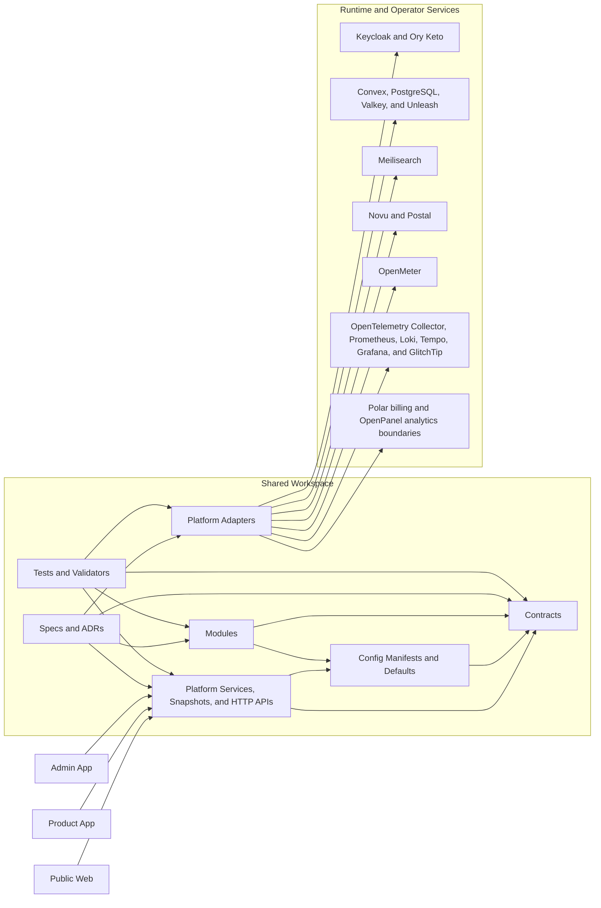

# Comvestec SaaS Foundation

Governed, backend-first SaaS infrastructure for Comvestec Solutions.

Reusable contracts, runtime services, platform adapters, and operator workflows for the public web, product app, and admin app.


> [!IMPORTANT]
> This repository is the product-line base for Comvestec Solutions, not a one-off app starter. Every change is expected to strengthen shared contracts, shared governance, and shared operator workflows.

## Architecture Snapshot



## Why This Foundation Exists

| Build once                                                                      | Govern centrally                                                             | Ship safely                                                                      |
| ------------------------------------------------------------------------------- | ---------------------------------------------------------------------------- | -------------------------------------------------------------------------------- |
| Shared packages keep policy, contracts, and runtime behavior out of app shells. | Specs, ADRs, manifests, hooks, and workflows keep platform rules reviewable. | Security scans, commit guards, and PR validation reduce drift before code lands. |

## Current Platform Baseline

The accepted specs describe the intended platform. Current delivery maturity for each area lives in [specs/00-governance/implementation-tracker.md](specs/00-governance/implementation-tracker.md).

- Apps: TanStack Start shells for the public web, product app, and admin app, with backend-owned services and HTTP routes treated as the delivery gate for the first slice.
- Shared backend: Effect-based contracts, runtime services, backend-owned HTTP APIs, typed config helpers, and a 19-manifest module catalog with per-capability maturity tracked in the implementation tracker.
- Governance: Core specs, backend-readiness roadmap, 16 accepted ADRs, grouped commit enforcement, PR governance validation, and label sync.
- Platform adapters: 14 adapter service boundaries across identity, storage, messaging, observability, search, and billing or metering concerns.
- Local ops baseline: Pinned Compose services for PostgreSQL, Keycloak, Convex, Valkey, Ory Keto, Unleash, Meilisearch, Novu, OpenMeter, Postal, GlitchTip, Prometheus, Loki, Tempo, Grafana, and the OpenTelemetry Collector.
- Validation: Jest through Bun, Playwright scaffold, path-based labels, PR auto-assignment, and Trivy-backed security hygiene.

## Workflow That Keeps The Repo Clean

1. Branch from `dev` using `<type>/<scope>-<short-slug>`.
2. Let local hooks block bad branch names, malformed commit messages, mixed staged change groups, formatting drift, type regressions, and test failures before push.
3. Open a PR into `dev`; GitHub applies path-based labels automatically and auto-assigns the PR author when the author is assignable.
4. Keep the PR body aligned with `.github/pull_request_template.md`.
5. Merge only when formatting, types, tests, PR governance, label sync, and security hygiene are green.

## Quick Start

```bash
bun install
bun run hooks:install
bun run format:check
bun run typecheck
bun run test
docker compose --env-file .env -f ops/docker/compose.yml up -d
bun run db:migrate
bun run backend:subscriber-journey:bootstrap
```

Before starting the local stack, copy `.env.example` to `.env` if you have not already done so. The example env file now uses three provenance categories that match the current runtime pattern: seeded locally, generated during bootstrap, and external-provider supplied. Leave the seeded local defaults in place, then replace only the bootstrap-generated or external-provider sentinel values when those services are actually provisioned.

Use [ops/docker/README.md](ops/docker/README.md) as the operator index for first-run commands, concern-owned service groups, and the runbooks that explain bootstrap-generated values such as the Convex admin key, GlitchTip DSN, OpenPanel client id, and other service credentials.

The PostgreSQL-backed backend modules now ship with a repo-owned Drizzle workflow. `bun run db:generate` creates reviewable SQL migrations from [packages/modules/src/persistence/postgres/schema.ts](packages/modules/src/persistence/postgres/schema.ts), and `bun run db:migrate` applies them against `POSTGRES_URL` from the shell or `.env`.

The backend subscriber-journey operator flow now has two focused entrypoints. `bun run backend:subscriber-journey:bootstrap` wraps `db:migrate`, keeps the local Keycloak client redirect surface aligned with the repo defaults, and creates or updates the Keycloak smoke user. `bun run backend:subscriber-journey` starts the backend-owned HTTP API, and `bun run backend:subscriber-journey:live-smoke` drives the live Keycloak-to-Polar kickoff through those HTTP contracts up to the hosted Polar checkout session.

The live smoke kickoff requires a real `POLAR_ACCESS_TOKEN` and a `POLAR_WEBHOOK_SECRET` captured from Polar CLI local forwarding. With the backend API running, use `polar listen http://127.0.0.1:3010/api/subscriber-journey/billing/webhooks/polar`, copy the reported secret into `.env`, and then run `bun run backend:subscriber-journey:live-smoke`. `SUBSCRIBER_JOURNEY_PUBLIC_BASE_URL` is now optional and only needed when you want the smoke script to print externally reachable webhook and replay URLs.

`ops/docker/compose.yml` is the only Compose entrypoint. It includes concern-owned Compose files from `ops/docker/observability/`, `ops/docker/identity/`, `ops/docker/feature-flags/`, `ops/docker/search/`, `ops/docker/messaging/`, `ops/docker/metering/`, `ops/docker/analytics/`, and `ops/docker/security/` while keeping one operator command surface.

OpenPanel analytics is part of the current platform dependency footprint and now starts by default through the main `ops/docker/compose.yml` entrypoint.

Kong and Vault are part of the current edge and secrets dependency footprint and now start by default through the same entrypoint.

See [ops/docker/README.md](ops/docker/README.md) for the compose file split, profile ownership, and common operator commands.

## Workspace Map

- `apps/`: application shells and route surfaces
- `packages/contracts/`: shared contracts, access rules, runtime schemas, and domain types
- `packages/config/`: typed defaults, environment modeling, and the module manifest registry
- `packages/modules/`: backend module implementations organized by concern
- `packages/platform/`: app snapshot services, backend-owned HTTP APIs, platform environment helpers, and adapter boundaries
- `specs/`: governance docs, platform specs, module specs, ADRs, and ops guidance
- `tests/`: contracts, modules, and platform validation
- `ops/`: local infrastructure composition, compose profiles, and operational assets
- `.github/`: workflows, templates, labels, instructions, and automation policy

## Quality Bar

1. Shared backend behavior lives in workspace packages, not duplicated across app shells.
2. Runtime config, approvals, audit, billing, entitlements, and compliance flows use durable PostgreSQL-backed state.
3. Authorization and field-level data exposure are platform concerns, not UI-only checks.
4. Reusable vocabularies live in shared constants and schemas instead of repeated string literals.
5. Dependencies stay pinned and continuously scanned; vendor CVEs are tracked without pretending drift disappears on its own.
6. Reuse named exported schema types such as `RequestContext` instead of re-deriving `Schema.Schema.Type<typeof RequestContextSchema>` in consuming code, and keep `unknown` limited to honest decode or external-boundary cases.
7. Runtime URLs, API keys, realms, and connection strings must come from validated environment input; adapters and services must not hide localhost or credential fallbacks in code.

## Governance Entry Points

- [CONTRIBUTING.md](CONTRIBUTING.md)
- [SECURITY.md](SECURITY.md)
- [CODE_OF_CONDUCT.md](CODE_OF_CONDUCT.md)
- [SUPPORT.md](SUPPORT.md)
- [LICENSE](LICENSE)
- [specs/README.md](specs/README.md)
- [specs/00-governance/implementation-tracker.md](specs/00-governance/implementation-tracker.md)
- [specs/00-governance/backend-readiness-roadmap.md](specs/00-governance/backend-readiness-roadmap.md)
- [.github/copilot-instructions.md](.github/copilot-instructions.md)

## Local Platform Endpoints

| Surface          | URL                         | Profile |
| ---------------- | --------------------------- | ------- |
| Public web       | `http://localhost:3000`     | default |
| Product app      | `http://localhost:3002`     | default |
| Admin app        | `http://localhost:3004`     | default |
| Convex API       | `http://127.0.0.1:3210`     | default |
| Convex dashboard | `http://localhost:6791`     | default |
| Keycloak         | `http://localhost:8080`     | default |
| Ory Keto read    | `http://localhost:4466`     | default |
| Ory Keto write   | `http://localhost:4467`     | default |
| Unleash          | `http://localhost:4242`     | default |
| Valkey           | `redis://localhost:6379`    | default |
| Meilisearch      | `http://localhost:7700`     | default |
| Novu             | `http://localhost:3100`     | default |
| OpenMeter        | `http://localhost:8889`     | default |
| Postal           | `http://localhost:5000`     | default |
| GlitchTip        | `http://localhost:8001`     | default |
| Grafana          | `http://localhost:3001`     | default |
| Prometheus       | `http://localhost:9090`     | default |
| Tempo            | `http://localhost:3200`     | default |
| OpenPanel        | `http://localhost:3005`     | default |
| OpenPanel API    | `http://localhost:3005/api` | default |
| Kong proxy       | `http://localhost:8000`     | default |
| Kong admin API   | `http://localhost:18001`    | default |
| Kong manager     | `http://localhost:18002`    | default |
| Vault            | `http://localhost:8200`     | default |
