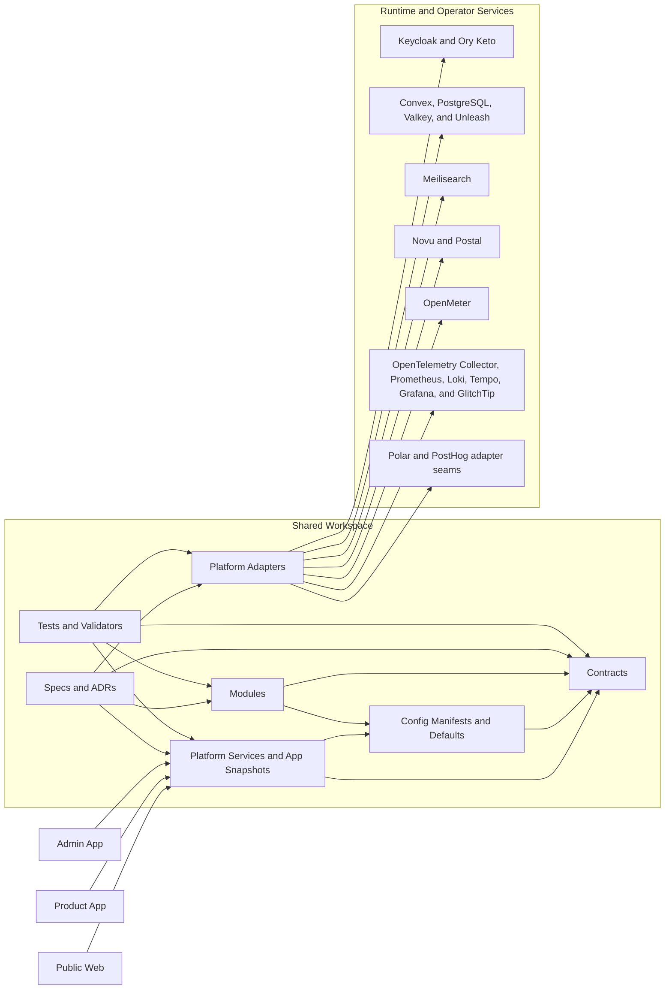

# Comvestec SaaS Foundation

Governed, backend-first SaaS infrastructure for Comvestec Solutions.

Reusable contracts, runtime services, platform adapters, and operator workflows for the public web, product app, and admin app.


> [!IMPORTANT]
> This repository is the product-line base for Comvestec Solutions, not a one-off app starter. Every change is expected to strengthen shared contracts, shared governance, and shared operator workflows.

## Architecture Snapshot



## Why This Foundation Exists

| Build once                                                                      | Govern centrally                                                             | Ship safely                                                                      |
| ------------------------------------------------------------------------------- | ---------------------------------------------------------------------------- | -------------------------------------------------------------------------------- |
| Shared packages keep policy, contracts, and runtime behavior out of app shells. | Specs, ADRs, manifests, hooks, and workflows keep platform rules reviewable. | Security scans, commit guards, and PR validation reduce drift before code lands. |

## Current Platform Slice

| Area               | What is already in place                                                                                                                                                                                |
| ------------------ | ------------------------------------------------------------------------------------------------------------------------------------------------------------------------------------------------------- |
| Apps               | TanStack Start shells for the public web, product app, and admin app                                                                                                                                    |
| Shared backend     | Effect-based contracts, runtime services, typed config helpers, and 18 module manifests                                                                                                                 |
| Governance         | Core specs, 15 accepted ADRs, grouped commit enforcement, PR governance validation, and label sync                                                                                                      |
| Platform adapters  | 14 adapters across identity, storage, messaging, observability, search, and billing or metering concerns                                                                                                |
| Local ops baseline | Pinned Compose services for PostgreSQL, Keycloak, Convex, Valkey, Ory Keto, Unleash, Meilisearch, Novu, OpenMeter, Postal, GlitchTip, Prometheus, Loki, Tempo, Grafana, and the OpenTelemetry Collector |
| Validation         | Jest through Bun, Playwright scaffold, path-based labels, PR auto-assignment, and Trivy-backed security hygiene                                                                                         |

## Workflow That Keeps The Repo Clean

1. Branch from `dev` using `<type>/<scope>-<short-slug>`.
2. Let local hooks block bad branch names, malformed commit messages, and mixed staged change groups before push.
3. Open a PR into `dev`; GitHub applies path-based labels automatically and auto-assigns the PR author when the author is assignable.
4. Keep the PR body aligned with `.github/pull_request_template.md`.
5. Merge only when formatting, types, tests, PR governance, label sync, and security hygiene are green.

## Quick Start

```bash
bun install
bun run hooks:install
bun run format:check
bun run typecheck
bun run test
docker compose --env-file .env -f ops/docker/compose.yml up -d
```

## Workspace Map

| Path                  | Purpose                                                                     |
| --------------------- | --------------------------------------------------------------------------- |
| `apps/`               | Application shells and route surfaces                                       |
| `packages/contracts/` | Shared contracts, access rules, runtime schemas, and domain types           |
| `packages/config/`    | Typed defaults, environment modeling, and the module manifest registry      |
| `packages/modules/`   | Backend module implementations organized by concern                         |
| `packages/platform/`  | App snapshot services, platform environment helpers, and adapter boundaries |
| `specs/`              | Governance docs, platform specs, module specs, ADRs, and ops guidance       |
| `tests/`              | Contracts, modules, and platform validation                                 |
| `ops/`                | Local infrastructure composition and operational assets                     |
| `.github/`            | Workflows, templates, labels, instructions, and automation policy           |

## Quality Bar

1. Shared backend behavior lives in workspace packages, not duplicated across app shells.
2. Runtime config, approvals, audit, billing, entitlements, and compliance flows use durable PostgreSQL-backed state.
3. Authorization and field-level data exposure are platform concerns, not UI-only checks.
4. Reusable vocabularies live in shared constants and schemas instead of repeated string literals.
5. Dependencies stay pinned and continuously scanned; vendor CVEs are tracked without pretending drift disappears on its own.

## Governance Entry Points

- [CONTRIBUTING.md](CONTRIBUTING.md)
- [SECURITY.md](SECURITY.md)
- [CODE_OF_CONDUCT.md](CODE_OF_CONDUCT.md)
- [SUPPORT.md](SUPPORT.md)
- [LICENSE](LICENSE)
- [specs/README.md](specs/README.md)
- [specs/00-governance/implementation-tracker.md](specs/00-governance/implementation-tracker.md)
- [.github/copilot-instructions.md](.github/copilot-instructions.md)

## Local Platform Endpoints

| Surface          | URL                      |
| ---------------- | ------------------------ |
| Public web       | `http://localhost:3000`  |
| Product app      | `http://localhost:3002`  |
| Admin app        | `http://localhost:3004`  |
| Convex API       | `http://127.0.0.1:3210`  |
| Convex dashboard | `http://localhost:6791`  |
| Keycloak         | `http://localhost:8080`  |
| Ory Keto read    | `http://localhost:4466`  |
| Ory Keto write   | `http://localhost:4467`  |
| Unleash          | `http://localhost:4242`  |
| Valkey           | `redis://localhost:6379` |
| Meilisearch      | `http://localhost:7700`  |
| Novu             | `http://localhost:3100`  |
| OpenMeter        | `http://localhost:8889`  |
| Postal           | `http://localhost:5000`  |
| GlitchTip        | `http://localhost:8001`  |
| Grafana          | `http://localhost:3001`  |
| Prometheus       | `http://localhost:9090`  |
| Tempo            | `http://localhost:3200`  |
